# OCP Lab

[](LICENSE)
[](https://docs.openshift.com)
[](.)
[](.)
[](.)
[](https://www.patternfly.org)

A self-service web portal and automation toolkit for deploying and managing OpenShift 4.x clusters on a shared KVM/libvirt host. Supports multiple installation methods (UPI and IPI baremetal) with resource-aware dynamic slot management and automatic cluster lifecycle enforcement. Users deploy clusters from the browser with a mandatory lifetime — DNS, HAProxy/keepalived, DHCP, VMs, and ignition are all handled automatically.

## Architecture

```
                         ┌──────────────────────────────────┐
                         │         Web Browser              │
                         │   (PatternFly 5 Dark Theme)      │
                         └──────────────┬───────────────────┘
                                        │ HTTPS + WebSocket
                         ┌──────────────▼───────────────────┐
                         │     Apache httpd (reverse proxy) │
                         │   /labs → :5000  (HTTP + WS)     │
                         └──────────────┬───────────────────┘
                                        │
                         ┌──────────────▼───────────────────┐
                         │   Lab Portal (Flask + SocketIO)  │
                         │  ┌─────────┐  ┌───────────────┐  │
                         │  │ SQLite  │  │ Lifecycle Mgr │  │
                         │  └─────────┘  └───────────────┘  │
                         │  ┌────────────────────────────┐  │
                         │  │Web Terminal (xterm.js/PTY) │  │
                         │  └────────────────────────────┘  │
                         └──────────────┬───────────────────┘
                                        │ subprocess
                    ┌───────────────────▼────────────────────┐
                    │   ocp-upi-deploy.sh / ocp-ipi-deploy.sh│
                    │  (detached, survives portal restart)   │
                    └───────────────────┬────────────────────┘
                                        │
          ┌─────────────┬───────────────┼───────────────┬─────────────┐
          ▼             ▼               ▼               ▼             ▼
   ┌────────────┐ ┌──────────┐  ┌────────────┐  ┌──────────┐  ┌──────────┐
   │  BIND DNS  │ │ HAProxy  │  │  libvirt   │  │  DHCP    │  │  VBMC    │
   │ (named)    │ │(UPI only)│  │ (KVM VMs)  │  │ (virsh)  │  │(IPI only)│
   └────────────┘ └──────────┘  └────────────┘  └──────────┘  └──────────┘
```

## Deployment Sequence

```mermaid
sequenceDiagram
    autonumber
    actor User
    participant Portal as Lab Portal
    participant Script as ocp-upi-deploy.sh
    participant Libvirt as KVM / libvirt
    participant OCP as OpenShift

    rect rgb(40, 40, 45)
    Note over User,Portal: Access & Deploy
    User->>Portal: Select cluster slot (upi1/upi2/upi3)
    User->>Portal: Choose OCP version, set lifetime, click Deploy
    Portal->>Script: Launch deploy (detached process)
    Portal-->>User: "Deployment started" toast notification
    end

    rect rgb(45, 35, 35)
    Note over Script,Libvirt: VM Provisioning
    Script->>Script: Download/cache openshift-install, oc, RHCOS ISO
    Script->>Script: Generate ignition configs
    loop For each node (bootstrap, 3 masters, 2 workers)
        Script->>Libvirt: Add DHCP reservation (virsh net-update)
        Script->>Libvirt: Create customized ISO (coreos-installer)
        Script->>Libvirt: Provision VM (virt-install)
        Libvirt-->>Script: VM boots, installs CoreOS, restarts from HDD
    end
    end

    rect rgb(35, 45, 35)
    Note over Script,OCP: Cluster Bootstrap
    Script->>OCP: wait-for bootstrap-complete (~30 min)
    Script->>Libvirt: Destroy bootstrap VM (reclaim RAM)
    Script->>OCP: Start csr-approver@<slot> systemd service
    Script->>OCP: wait-for install-complete
    OCP-->>Script: Cluster ready — MOTD updated with credentials
    end

    rect rgb(35, 35, 45)
    Note over Portal: Lifecycle Management
    Portal->>Portal: Background reaper checks every 5 min
    Portal->>Libvirt: Auto-delete expired clusters (VMs + storage)
    end
```



## Components

```
labs/
├── ocp-upi-deploy.sh        # Automated OCP UPI deployment script
├── ocp-ipi-deploy.sh        # Automated OCP IPI baremetal deployment script
├── cluster-infra-setup.sh    # One-time DNS + HAProxy infrastructure setup
├── csr-approver.sh           # Auto-approve CSRs until cluster ready (systemd template)
├── update-motd.sh            # Dynamic SSH MOTD — shows active clusters + credentials
├── labportal/
│   ├── app.py                # Flask + SocketIO app (routes, auth, terminal, lifecycle)
│   ├── config.py             # Configuration (install types, cluster slots, env vars)
│   ├── db.py                 # SQLite schema (users, deployments, reservations, extensions)
│   ├── requirements.txt      # Python dependencies (flask, flask-socketio)
│   ├── labportal.service     # systemd unit file for production deployment
│   ├── static/
│   │   └── style.css         # PatternFly 5 dark theme overrides
│   └── templates/
│       ├── base.html          # Layout with navbar and branding
│       ├── index.html         # Public homepage with live resource status
│       ├── user_login.html    # Unified login (users + admins)
│       ├── user_dashboard.html # Deploy/manage clusters, terminal access
│       ├── terminal.html      # Web terminal (xterm.js + SocketIO)
│       ├── cluster_logs.html  # Live deployment log viewer
│       ├── activity_log.html  # Admin activity log with filtering
│       ├── admin.html         # Admin panel (users, extensions, maintenance)
│       ├── setup.html         # First-run setup wizard
│       ├── forgot_password.html # Password reset request
│       └── reset_password.html  # Password reset form
└── README.md
```

## Cluster Lifecycle

Every cluster has a mandatory **lifetime** set at deploy time. When the lifetime expires, the cluster is **automatically deleted** — all VMs, storage, and records are destroyed.

| Lifetime Option | Duration |
|-----------------|----------|
| 3 hours | Short tests |
| 4 hours | Quick validations |
| 8 hours (default) | Day work |
| 1 day | Overnight tests |
| 2 days | Multi-day work |
| 3 days | Extended testing |
| 1 week | Max self-service |
| More than a week | Requires admin approval |

**Extension requests:** Selecting "More than a week" sets a 1-week initial lifetime and sends an extension request to the admin panel. Admins can approve (1-30 day extension) or deny. Denied requests expire at the original 1-week mark.

**Background reaper:** A daemon thread checks every 5 minutes for expired clusters and auto-deletes them, logging the event as `cluster_auto_delete`.

## Installation Methods

All clusters use **OVNKubernetes** as the network plugin. Resource availability (CPU, RAM) is checked before each deployment — deploys are blocked if insufficient resources are available.

### UPI (User Provisioned Infrastructure)

Pre-configured slots with fixed DNS and HAProxy — no service restarts needed when deploying or deleting clusters.

| Slot | IP Range | Bootstrap | Masters | Workers | Resources |
|------|----------|-----------|---------|---------|-----------|
| `upi1` | `.110 – .115` | `.110` | `.111 – .113` | `.114 – .115` | 16 vCPUs, 80G RAM |
| `upi2` | `.120 – .125` | `.120` | `.121 – .123` | `.124 – .125` | 16 vCPUs, 80G RAM |
| `upi3` | `.130 – .135` | `.130` | `.131 – .133` | `.134 – .135` | 16 vCPUs, 80G RAM |

All IPs on `192.168.122.0/24` (libvirt default network). API/apps traffic routes through HAProxy on `192.168.122.1`.

### IPI (Installer Provisioned Infrastructure — Baremetal)

Dynamic slot allocation — user provides a cluster name, the portal auto-assigns an IP offset from the `140–190` range (blocks of 10).

| Component | Details |
|-----------|---------|
| Masters | 3 VMs, 8 vCPUs, 32G RAM each |
| Workers | 2 VMs, 4 vCPUs, 16G RAM each |
| VIPs | API VIP = `.offset`, Ingress VIP = `.offset+1` (managed by keepalived on nodes) |
| Master IPs | `.offset+2` through `.offset+4` |
| Worker IPs | `.offset+5` through `.offset+6` |
| Provisioning | PXE boot via ironic over `provisioning` network (`192.168.0.0/24`) |
| BMC | VirtualBMC (VBMC) exposes VMs as IPMI endpoints for the installer |
| DNS | Dynamic records in include files (`/var/named/ipi-forward.include`, `ipi-reverse.include`) |
| HAProxy | Not needed — IPI uses keepalived VIPs on the nodes |
| Bootstrap | Created and destroyed automatically by `openshift-install` |

## Prerequisites

| Component | Purpose | Install |
|-----------|---------|---------|
| KVM / libvirt | VM hypervisor | `dnf install -y libvirt qemu-kvm virt-install` |
| BIND (named) | DNS for cluster domains | `dnf install -y bind bind-utils` |
| HAProxy | Load balancer (UPI API/ingress) | `dnf install -y haproxy` |
| coreos-installer | RHCOS ISO customization (UPI) | `dnf install -y coreos-installer` |
| VirtualBMC | IPMI simulation for IPI | `pip install virtualbmc` |
| ipmitool | VBMC verification | `dnf install -y ipmitool` |
| Python 3 + Flask + SocketIO | Web portal + terminal | `pip install -r labportal/requirements.txt` |
| Apache httpd + mod_proxy_wstunnel | Reverse proxy (HTTP + WebSocket) | `dnf install -y httpd mod_proxy_html` |

**Additionally required:**
- OpenShift pull secret ([Get one here](https://console.redhat.com/openshift/install/pull-secret)) — default location: `/root/pull-secret.txt`, override with `PULL_SECRET_FILE` env var
- SSH public key — default: `~/.ssh/id_ed25519.pub`, override with `SSH_KEY_FILE` env var
- For IPI: `provisioning` libvirt network and `vbmcd` service (see below)

**IPI provisioning network setup:**

```bash
# Create the provisioning network for IPI baremetal PXE boot
cat > /tmp/provisioning-net.xml <<EOF
<network>
  <name>provisioning</name>
  <bridge name='provisioning' stp='on' delay='0'/>
  <ip address='192.168.0.1' netmask='255.255.255.0'/>
</network>
EOF
virsh net-define /tmp/provisioning-net.xml
virsh net-start provisioning
virsh net-autostart provisioning

# Start VirtualBMC daemon
pip install virtualbmc
vbmcd
```

## Setup

### 1. Infrastructure (one-time)

```bash
# Set up DNS zones and HAProxy config for all cluster slots
chmod +x cluster-infra-setup.sh
sudo ./cluster-infra-setup.sh
```

The script will:
- Check that `named`, `haproxy`, and `libvirtd` are installed
- Warn before overwriting existing configs not created by this script
- Back up any existing configs before replacing them
- Generate forward/reverse DNS zones for `upi1`, `upi2`, `upi3`
- Generate HAProxy config with SNI-based routing
- Validate and reload both services
- Verify DNS resolution

### 2. Portal

```bash
cd labportal
pip install -r requirements.txt

# Run directly (development)
python3 app.py
# First run: visit http://localhost:5000/labs/setup to create admin account

# Or via systemd (production)
sudo cp labportal.service /etc/systemd/system/
sudo systemctl daemon-reload
sudo systemctl enable --now labportal
```

### 3. Apache Reverse Proxy

Generate a self-signed certificate (or use your own):

```bash
openssl req -x509 -nodes -days 365 -newkey rsa:2048 \
    -keyout /etc/pki/tls/private/labportal.key \
    -out /etc/pki/tls/certs/labportal.crt \
    -subj "/CN=$(hostname)"
```

```apache
# /etc/httpd/conf.d/labportal.conf
<VirtualHost *:443>
    SSLEngine on
    SSLCertificateFile    /etc/pki/tls/certs/labportal.crt
    SSLCertificateKeyFile /etc/pki/tls/private/labportal.key

    ProxyPreserveHost On
    ProxyTimeout 3600

    # WebSocket proxy for terminal (must come before regular ProxyPass)
    RewriteEngine On
    RewriteCond %{HTTP:Upgrade} websocket [NC]
    RewriteCond %{HTTP:Connection} upgrade [NC]
    RewriteRule ^/labs/socket.io/(.*) ws://127.0.0.1:5000/socket.io/$1 [P,L]

    ProxyPass        /labs/socket.io ws://127.0.0.1:5000/socket.io
    ProxyPassReverse /labs/socket.io ws://127.0.0.1:5000/socket.io
    ProxyPass        /labs/ http://127.0.0.1:5000/
    ProxyPassReverse /labs/ http://127.0.0.1:5000/
</VirtualHost>
```

## Configuration

All settings via environment variables (or defaults in `config.py`):

| Variable | Default | Description |
|----------|---------|-------------|
| `LABPORTAL_SECRET_KEY` | *(required in prod)* | Flask session secret — app refuses to start without it unless `FLASK_ENV=development` |
| `LABPORTAL_CORS_ORIGINS` | `https://lab.example.com` | Allowed CORS origins for SocketIO (comma-separated for multiple) |
| `LABPORTAL_ADMIN_USER` | `admin` | Admin login username |
| `LABPORTAL_DB` | `labportal/labportal.db` | SQLite database path |
| `LABPORTAL_HOSTNAME` | `lab.example.com` | Hostname shown in UI |
| `LABPORTAL_UPI_SCRIPT` | `/root/labs/ocp-upi-deploy.sh` | Path to UPI deploy script |
| `LABPORTAL_IPI_SCRIPT` | `/root/labs/ocp-ipi-deploy.sh` | Path to IPI deploy script |
| `CLUSTERS_DIR` | `/kvm/clusters` | Directory where cluster artifacts are stored |
| `PULL_SECRET_FILE` | `/root/pull-secret.txt` | Path to OpenShift pull secret |
| `SSH_KEY_FILE` | `~/.ssh/id_ed25519.pub` | Path to SSH public key |

## Security

The host runs with SELinux **enforcing** at all times. Firewall ports are opened only as needed.

| Aspect | Policy |
|--------|--------|
| SELinux | Always enforcing; never set to permissive |
| Firewall | Default-deny; only required ports are opened per zone |
| VBMC ports | UDP 6230-6260 opened in `libvirt` zone only (for ironic on provisioning network) |
| VNC | Bound to `127.0.0.1` only — not exposed to the network |
| DNS zone files | Owned by `named:named` with `named_zone_t` SELinux context; IPI uses separate include files owned by `root:named` |
| Portal | Runs as root via systemd; proxied through Apache with HTTPS/TLS |
| SSH accounts | Password expiry (180 days), account lockout after 30 days inactivity, forced password change on first login |

## Usage

### Deploy a Cluster

1. Log in to the portal
2. Select an install type (UPI or IPI)
3. For UPI: select an available cluster slot; for IPI: enter a cluster name
4. Enter the OCP version (e.g., `4.20.5`) — version is validated against the OCP mirror
5. Set the **cluster lifetime** (3 hours to 1 week) — the cluster will be auto-deleted when this expires
6. Optionally enter a purpose description
7. Click **Deploy Cluster** — resource availability is checked before launching
8. Monitor progress via **View Logs**

### Extend a Cluster Beyond 1 Week

1. Select "More than a week (needs approval)" as the lifetime
2. The cluster deploys with a 1-week initial lifetime
3. An extension request is sent to the admin panel
4. Admin reviews and approves (1-30 day extension) or denies

### CLI Deploy (without portal)

```bash
# UPI: Deploy OCP 4.20.5 in slot upi1 (IP offset 110)
sudo ./ocp-upi-deploy.sh 4.20.5 upi1 110

# IPI: Deploy cluster with 3 masters + 2 workers (IP offset 140)
sudo ./ocp-ipi-deploy.sh 4.20.5 ipi1 140
```

### Delete a Cluster

Click **Delete Cluster** in the portal dashboard (or wait for the lifetime to expire). This will:
- Destroy and undefine all VMs (`virsh destroy` + `virsh undefine --remove-all-storage`)
- For IPI: additionally clean up VBMC entries, DHCP reservations, and DNS include records
- Remove deployment logs
- Clean up database records
- Free the slot/offset for reuse

## Portal Features

| Feature | Description |
|---------|-------------|
| **Live Dashboard** | Real-time RAM, storage, CPU utilization, VM count with SVG ring charts (5s polling) |
| **Cluster Lifecycle** | Mandatory lifetime at deploy time; background reaper auto-deletes expired clusters |
| **Extension Requests** | "More than a week" triggers admin approval flow; admin can extend 1-30 days |
| **Web Terminal** | Browser-based shell via xterm.js + SocketIO; per-cluster Terminal buttons auto-set KUBECONFIG; 1-hour inactivity timeout |
| **Activity Log** | Tracks login, logout, deploy, delete, auto-delete, terminal events with user/IP; admin-visible with filtering and pagination |
| **User Management** | Admin creates accounts with auto-generated passwords; Linux user creation with group-based access; enable/disable toggle |
| **Unified Login** | Single login page for users and admins; admin privileges granted via `is_admin` flag |
| **Password Reset** | Self-service forgot password flow; admin-approved reset with forced password change |
| **Install Types** | UPI (fixed slots, HAProxy) and IPI baremetal (dynamic names, VBMC/ironic, keepalived) |
| **Resource Check** | Validates CPU/RAM availability before deploying; blocks if insufficient |
| **Version Validation** | Checks OCP version exists on the mirror before starting deployment |
| **Cluster Deploy** | One-click deploy with install type picker, detached process |
| **Cluster Delete** | Admin: any cluster. Users: only their own. Cleans up VMs, storage, VBMC, DNS, DB records |
| **View Logs** | Live log tail (last 200 lines) with auto-refresh during deploy |
| **CSR Auto-Approver** | Systemd template service (`csr-approver@<cluster>`) auto-approves CSRs until all ClusterOperators are Available or 2-hour timeout |
| **Dynamic MOTD** | SSH login banner shows active clusters, versions (from live API), credentials, and KUBECONFIG paths |
| **Maintenance Banner** | Admin-configurable maintenance message displayed site-wide |
| **Toast Notifications** | Centered drop-in popups, auto-dismiss after 6s |
| **Dark Theme** | PatternFly 5 dark UI with Red Hat Display typography |

## VM Specifications

### UPI Clusters

| Role | Count | RAM | vCPUs | Disk | VM Name |
|------|-------|-----|-------|------|---------|
| Bootstrap | 1 | 32 GB | 8 | 120 GB | `vm-<slot>-bootstrap` |
| Master | 3 | 32 GB | 8 | 120 GB | `vm-<slot>-master-{0,1,2}` |
| Worker | 2 | 16 GB | 4 | 120 GB | `vm-<slot>-worker-{0,1}` |

Bootstrap VM is automatically destroyed after bootstrap-complete to reclaim resources.

### IPI Clusters

| Role | Count | RAM | vCPUs | Disk | VM Name |
|------|-------|-----|-------|------|---------|
| Master | 3 | 32 GB | 8 | 120 GB | `vm-<name>-master-{0,1,2}` |
| Worker | 2 | 16 GB | 4 | 120 GB | `vm-<name>-worker-{0,1}` |

Bootstrap VM is created and destroyed automatically by `openshift-install`.

## HAProxy Routing

Traffic routing uses SNI inspection (TLS) and Host headers (HTTP) — no VIPs required:

| Port | Protocol | Routing Method | Backends |
|------|----------|---------------|----------|
| 6443 | TCP/TLS | SNI: `api.<slot>.example.com` | Masters (bootstrap as backup) |
| 22623 | TCP/TLS | SNI: `api-int.<slot>.example.com` | Masters (bootstrap as backup) |
| 443 | TCP/TLS | SNI: `*.apps.<slot>.example.com` | Workers |
| 80 | HTTP | Host header: `*.apps.<slot>.example.com` | Workers |

## License

Apache License 2.0 — see [LICENSE](LICENSE) for details.
