# OCP UPI Lab

[](.)
[](https://docs.openshift.com)
[](.)
[](.)
[](.)
[](https://www.patternfly.org)

A self-service web portal and automation toolkit for deploying and managing OpenShift 4.x UPI clusters on a shared KVM/libvirt host. Users request access, admins approve, and approved users deploy clusters from the browser — DNS, HAProxy, DHCP, VMs, and ignition are all handled automatically.

## Architecture

```
                         ┌──────────────────────────────────┐
                         │         Web Browser              │
                         │   (PatternFly 5 Dark Theme)      │
                         └──────────────┬───────────────────┘
                                        │ HTTPS
                         ┌──────────────▼───────────────────┐
                         │     Apache httpd (reverse proxy)  │
                         │        /labs  →  :5000            │
                         └──────────────┬───────────────────┘
                                        │
                         ┌──────────────▼───────────────────┐
                         │        Lab Portal (Flask)         │
                         │  ┌─────────┐  ┌───────────────┐  │
                         │  │ SQLite  │  │  SMTP Mailer   │  │
                         │  └─────────┘  └───────────────┘  │
                         └──────────────┬───────────────────┘
                                        │ subprocess
                    ┌───────────────────▼────────────────────┐
                    │         ocp-upi-deploy.sh              │
                    │  (detached, survives portal restart)    │
                    └───────────────────┬────────────────────┘
                                        │
          ┌─────────────┬───────────────┼───────────────┬─────────────┐
          ▼             ▼               ▼               ▼             ▼
   ┌────────────┐ ┌──────────┐  ┌────────────┐  ┌──────────┐  ┌──────────┐
   │  BIND DNS  │ │ HAProxy  │  │  libvirt   │  │  DHCP    │  │  RHCOS   │
   │ (named)    │ │ (SNI LB) │  │ (KVM VMs)  │  │ (virsh)  │  │  ISOs    │
   └────────────┘ └──────────┘  └────────────┘  └──────────┘  └──────────┘
```

## Deployment Sequence

```mermaid
sequenceDiagram
    autonumber
    actor User
    participant Portal as Lab Portal
    participant Script as ocp-upi-deploy.sh
    participant Libvirt as KVM / libvirt
    participant OCP as OpenShift

    rect rgb(40, 40, 45)
    Note over User,Portal: Access & Deploy
    User->>Portal: Select cluster slot (upi1/upi2/upi3)
    User->>Portal: Choose OCP version, click Deploy
    Portal->>Script: Launch deploy (detached process)
    Portal-->>User: "Deployment started" toast notification
    end

    rect rgb(45, 35, 35)
    Note over Script,Libvirt: VM Provisioning
    Script->>Script: Download/cache openshift-install, oc, RHCOS ISO
    Script->>Script: Generate ignition configs
    loop For each node (bootstrap, 3 masters, 2 workers)
        Script->>Libvirt: Add DHCP reservation (virsh net-update)
        Script->>Libvirt: Create customized ISO (coreos-installer)
        Script->>Libvirt: Provision VM (virt-install)
        Libvirt-->>Script: VM boots, installs CoreOS, restarts from HDD
    end
    end

    rect rgb(35, 45, 35)
    Note over Script,OCP: Cluster Bootstrap
    Script->>OCP: wait-for bootstrap-complete (~30 min)
    Script->>Libvirt: Destroy bootstrap VM (reclaim RAM)
    Script->>OCP: Auto-approve CSRs (background loop)
    Script->>OCP: wait-for install-complete
    OCP-->>Script: Cluster ready — credentials written to /etc/motd
    end
```



## Components

```
labs/
├── ocp-upi-deploy.sh        # Automated OCP UPI deployment script
├── cluster-infra-setup.sh    # One-time DNS + HAProxy infrastructure setup
├── labportal/
│   ├── app.py                # Flask application (routes, auth, cluster mgmt)
│   ├── config.py             # Configuration (env vars, cluster slots)
│   ├── db.py                 # SQLite schema (users, requests, deployments)
│   ├── mail.py               # SMTP email notifications
│   ├── requirements.txt      # Python dependencies
│   ├── static/
│   │   └── style.css         # PatternFly 5 dark theme overrides
│   └── templates/
│       ├── base.html          # Layout with branding
│       ├── index.html         # Public homepage with live status
│       ├── user_login.html    # User login form
│       ├── user_dashboard.html # Deploy/manage clusters
│       ├── cluster_logs.html  # Live deployment log viewer
│       ├── request_form.html  # Access request form
│       ├── admin.html         # Admin panel (requests + users)
│       └── login.html         # Admin login
└── README.md
```

## Predefined Cluster Slots

DNS and HAProxy are configured once for all slots — no service restarts needed when deploying or deleting clusters. HAProxy health checks automatically detect backend availability.

| Slot | IP Range | Bootstrap | Masters | Workers | HAProxy Routing |
|------|----------|-----------|---------|---------|-----------------|
| `upi1` | `.110 – .115` | `.110` | `.111 – .113` | `.114 – .115` | SNI: `*.upi1.example.com` |
| `upi2` | `.120 – .125` | `.120` | `.121 – .123` | `.124 – .125` | SNI: `*.upi2.example.com` |
| `upi3` | `.130 – .135` | `.130` | `.131 – .133` | `.134 – .135` | SNI: `*.upi3.example.com` |

All IPs on `192.168.122.0/24` (libvirt default network). API/apps traffic routes through HAProxy on `192.168.122.1`.

## Prerequisites

| Component | Purpose | Install |
|-----------|---------|---------|
| KVM / libvirt | VM hypervisor | `dnf install -y libvirt qemu-kvm virt-install` |
| BIND (named) | DNS for cluster domains | `dnf install -y bind bind-utils` |
| HAProxy | Load balancer (API, ingress) | `dnf install -y haproxy` |
| coreos-installer | RHCOS ISO customization | `dnf install -y coreos-installer` |
| Python 3 + Flask | Web portal | `pip install -r labportal/requirements.txt` |
| Apache httpd | Reverse proxy for `/labs` | `dnf install -y httpd` |

**Additionally required:**
- OpenShift pull secret at `/root/pull-secret.txt` ([Get one here](https://console.redhat.com/openshift/install/pull-secret))
- SSH public key at `~/.ssh/id_ed25519.pub`

## Setup

### 1. Infrastructure (one-time)

```bash
# Set up DNS zones and HAProxy config for all cluster slots
chmod +x cluster-infra-setup.sh
sudo ./cluster-infra-setup.sh
```

The script will:
- Check that `named`, `haproxy`, and `libvirtd` are installed
- Warn before overwriting existing configs not created by this script
- Back up any existing configs before replacing them
- Generate forward/reverse DNS zones for `upi1`, `upi2`, `upi3`
- Generate HAProxy config with SNI-based routing
- Validate and reload both services
- Verify DNS resolution

### 2. Portal

```bash
cd labportal
pip install -r requirements.txt

# Set admin password
python3 app.py set-password

# Run directly (development)
python3 app.py

# Or via systemd (production)
sudo systemctl enable --now labportal
```

### 3. Apache Reverse Proxy

```apache
# /etc/httpd/conf.d/labportal.conf
ProxyPass        /labs http://127.0.0.1:5000/labs
ProxyPassReverse /labs http://127.0.0.1:5000/labs
```

## Configuration

All settings via environment variables (or defaults in `config.py`):

| Variable | Default | Description |
|----------|---------|-------------|
| `LABPORTAL_SECRET_KEY` | random | Flask session secret |
| `LABPORTAL_ADMIN_USER` | `admin` | Admin login username |
| `LABPORTAL_DB` | `labportal/labportal.db` | SQLite database path |
| `LABPORTAL_HOSTNAME` | `lab.example.com` | Hostname shown in UI |
| `LABPORTAL_SMTP_HOST` | `smtp.example.com` | SMTP server |
| `LABPORTAL_SMTP_PORT` | `25` | SMTP port |
| `LABPORTAL_ADMIN_EMAIL` | `admin@example.com` | Admin notification email |
| `LABPORTAL_FROM_EMAIL` | `labportal@lab.example.com` | Sender address |
| `LABPORTAL_DEPLOY_SCRIPT` | `/root/ocp-upi-deploy.sh` | Path to deploy script |

## Usage

### Deploy a Cluster

1. Log in to the portal
2. Select an available cluster slot (`upi1`, `upi2`, or `upi3`)
3. Enter the OCP version (e.g., `4.20.5`)
4. Click **Deploy Cluster**
5. Monitor progress via **View Logs**

### CLI Deploy (without portal)

```bash
# Deploy OCP 4.20.5 in slot upi1 (IP offset 110)
sudo ./ocp-upi-deploy.sh 4.20.5 upi1 110

# Deploy a second cluster in slot upi2 (IP offset 120)
sudo ./ocp-upi-deploy.sh 4.20.5 upi2 120
```

### Delete a Cluster

Click **Delete Cluster** in the portal dashboard. This will:
- Destroy and undefine all VMs (`virsh destroy` + `virsh undefine --remove-all-storage`)
- Remove deployment logs
- Clean up database records
- Free the slot for reuse

## Portal Features

| Feature | Description |
|---------|-------------|
| **Live Dashboard** | Real-time RAM, storage, CPU, VM count with SVG ring charts (5s polling) |
| **Access Requests** | Email domain validation, spam protection (1 request / 24h) |
| **User Accounts** | Created on admin approval, credentials emailed, enable/disable toggle |
| **Cluster Deploy** | One-click deploy from predefined slots, detached process |
| **Cluster Delete** | Admin: any cluster. Users: only their own |
| **View Logs** | Live log tail (last 200 lines) with auto-refresh during deploy |
| **Toast Notifications** | Centered drop-in popups, auto-dismiss after 6s |
| **Dark Theme** | PatternFly 5 dark UI with custom typography |

## VM Specifications

| Role | Count | RAM | vCPUs | Disk | VM Name |
|------|-------|-----|-------|------|---------|
| Bootstrap | 1 | 32 GB | 8 | 120 GB | `vm-<slot>-bootstrap` |
| Master | 3 | 32 GB | 8 | 120 GB | `vm-<slot>-master-{0,1,2}` |
| Worker | 2 | 16 GB | 4 | 120 GB | `vm-<slot>-worker-{0,1}` |

Bootstrap VM is automatically destroyed after bootstrap-complete to reclaim resources.

## HAProxy Routing

Traffic routing uses SNI inspection (TLS) and Host headers (HTTP) — no VIPs required:

| Port | Protocol | Routing Method | Backends |
|------|----------|---------------|----------|
| 6443 | TCP/TLS | SNI: `api.<slot>.example.com` | Masters (bootstrap as backup) |
| 22623 | TCP/TLS | SNI: `api-int.<slot>.example.com` | Masters (bootstrap as backup) |
| 443 | TCP/TLS | SNI: `*.apps.<slot>.example.com` | Workers |
| 80 | HTTP | Host header: `*.apps.<slot>.example.com` | Workers |

## License

Internal tooling.
